# SASE Lab Architecture Documentation

This document provides comprehensive architectural diagrams and component relationships for the SASE (Secure Access Service Edge) lab environment.

## High-Level SASE Architecture


## Detailed Component Architecture

```mermaid
graph LR
    subgraph "Identity & Access Management"
        direction TB
        IAM_SIM[Zitadel Simulation<br/>Port 9080]
        IAM_FEATURES[OAuth2/OIDC<br/>Multi-Factor Auth<br/>User Lifecycle<br/>Enterprise SSO]
        IAM_SIM --> IAM_FEATURES
    end

    subgraph "Zero Trust Network Access"
        direction TB
        ZTNA_SIM[OpenZiti Simulation<br/>Port 1280]
        ZTNA_FEATURES[Micro-tunnels<br/>Identity-based Policies<br/>End-to-End Encryption<br/>Application Access]
        ZTNA_SIM --> ZTNA_FEATURES
    end

    subgraph "Secure Web Gateway"
        direction TB
        SWG_NGINX[OPNsense + Nginx<br/>Port 443 (HTTPS)<br/>Port 3128 (Proxy)]
        SWG_FEATURES[URL Filtering<br/>Malware Detection<br/>SSL Inspection<br/>Content Blocking]
        SWG_SSL[SSL Certificates<br/>Self-signed for Demo]
        SWG_NGINX --> SWG_FEATURES
        SWG_NGINX --> SWG_SSL
    end

    subgraph "Cloud Access Security Broker"
        direction TB
        CASB_SIM[Cloud Custodian<br/>Ubuntu Container]
        CASB_FEATURES[Policy-as-Code<br/>Shadow IT Detection<br/>Data Loss Prevention<br/>Compliance Monitoring]
        CASB_POLICIES[Policy Files<br/>YAML Configuration<br/>AWS Simulation]
        CASB_SIM --> CASB_FEATURES
        CASB_SIM --> CASB_POLICIES
    end

    subgraph "SD-WAN Router"
        direction TB
        SDWAN_SIM[VyOS Simulation<br/>Ubuntu + Networking Tools]
        SDWAN_FEATURES[Traffic Optimization<br/>Routing Policies<br/>Quality of Service<br/>Failover]
        SDWAN_PORTS[SSH: Port 2223<br/>Web: Port 9444]
        SDWAN_SIM --> SDWAN_FEATURES
        SDWAN_SIM --> SDWAN_PORTS
    end

    %% Component interactions
    IAM_SIM <-->|Identity Verification| ZTNA_SIM
    ZTNA_SIM <-->|Access Control| SWG_NGINX
    SWG_NGINX <-->|Traffic Filtering| CASB_SIM
    SDWAN_SIM <-->|Network Routing| SWG_NGINX

    classDef identity fill:#e3f2fd,stroke:#1976d2,stroke-width:2px
    classDef ztna fill:#f1f8e9,stroke:#388e3c,stroke-width:2px
    classDef gateway fill:#fff8e1,stroke:#f57c00,stroke-width:2px
    classDef casb fill:#fce4ec,stroke:#c2185b,stroke-width:2px
    classDef sdwan fill:#f3e5f5,stroke:#7b1fa2,stroke-width:2px

    class IAM_SIM,IAM_FEATURES identity
    class ZTNA_SIM,ZTNA_FEATURES ztna
    class SWG_NGINX,SWG_FEATURES,SWG_SSL gateway
    class CASB_SIM,CASB_FEATURES,CASB_POLICIES casb
    class SDWAN_SIM,SDWAN_FEATURES,SDWAN_PORTS sdwan
```

## Network Topology and Segmentation


## Data Flow and Security Enforcement

```mermaid
sequenceDiagram
    participant User as 👤 Remote User
    participant IAM as 🔐 Identity Mgmt
    participant ZTNA as 🛡️ Zero Trust
    participant SWG as 🌐 Web Gateway
    participant FW as 🔥 Firewall
    participant CASB as ☁️ CASB
    participant App as 🏢 Corporate App
    participant Monitor as 📊 Monitoring

    Note over User, Monitor: SASE Security Flow

    User->>IAM: 1. Authentication Request
    IAM->>IAM: Verify credentials, MFA
    IAM->>User: 2. Identity Token

    User->>ZTNA: 3. Access Request + Token
    ZTNA->>IAM: Validate token
    IAM->>ZTNA: Token valid
    ZTNA->>ZTNA: Check access policies
    ZTNA->>User: 4. Access granted

    User->>SWG: 5. Web request
    SWG->>SWG: URL filtering, malware scan
    SWG->>FW: 6. Forward if clean
    FW->>FW: Apply firewall rules
    
    FW->>CASB: 7. Check cloud policies
    CASB->>CASB: Evaluate DLP, compliance
    CASB->>FW: Policy decision
    
    FW->>App: 8. Forward to application
    App->>App: Process request
    App->>FW: 9. Response
    
    FW->>SWG: 10. Response
    SWG->>User: 11. Filtered response

    Note over Monitor: Continuous Monitoring
    SWG->>Monitor: Security events
    ZTNA->>Monitor: Access logs
    CASB->>Monitor: Policy violations
    FW->>Monitor: Traffic logs
    App->>Monitor: Application logs
```



## Container and Service Mapping


## Port Mapping and Service Access

| Component | Container Name | Image | Internal Port | External Port | Purpose |
|-----------|---------------|-------|---------------|---------------|---------|
| **Corporate Applications** |
| HR Portal | sase-corp-app-1 | nginx:alpine | 80 | 9081 | Internal employee portal |
| File Server | sase-corp-app-2 | httpd:alpine | 80 | 9082 | Document management |
| **DMZ Services** |
| Web Server | sase-dmz-web | nginx:alpine | 80 | 9083 | Public web services |
| **External Services** |
| Internet Sim | sase-external-service | httpd:alpine | 80 | 9084 | External threat simulation |
| **SASE Security Services** |
| Secure Web Gateway | sase-opnsense | nginx:alpine | 443, 3128 | 443, 3128 | Web filtering, SSL inspection |
| Identity Management | sase-zitadel-simulation | nginx:alpine | 80 | 9080 | OAuth2/OIDC simulation |
| Zero Trust Access | sase-ziti-simulation | nginx:alpine | 80 | 1280 | ZTNA policy simulation |
| SD-WAN Router | sase-vyos | ubuntu:22.04 | 22, 8443 | 2223, 9444 | Network routing simulation |
| **Monitoring Stack** |
| Elasticsearch | sase-elasticsearch | elasticsearch:8.11.0 | 9200 | 9200 | Search and analytics |
| Kibana | sase-kibana | kibana:8.11.0 | 5601 | 5601 | Visualization dashboard |
| Logstash | sase-logstash | logstash:8.11.0 | 5044, 9600 | 5044, 9600 | Log processing |

## Security Zones and Trust Levels

```mermaid
graph LR
    subgraph "Trust Levels"
        direction TB
        UNTRUSTED[Untrusted Zone<br/>External Network<br/>🔴 No Trust]
        LIMITED[Limited Trust<br/>DMZ Network<br/>🟡 Controlled Access]
        TRUSTED[Trusted Zone<br/>Corporate Network<br/>🟢 Full Trust]
        MANAGEMENT[Management Zone<br/>Admin Network<br/>🔵 Administrative]
    end

    subgraph "Security Controls"
        direction TB
        PERIMETER[Perimeter Security<br/>SWG + Firewall]
        IDENTITY[Identity Controls<br/>IAM + ZTNA]
        DATA[Data Protection<br/>CASB + DLP]
        MONITORING[Continuous Monitoring<br/>SIEM + Analytics]
    end

    UNTRUSTED -->|All Traffic Inspected| PERIMETER
    PERIMETER -->|Authenticated Users| IDENTITY
    IDENTITY -->|Authorized Access| LIMITED
    IDENTITY -->|Verified Identity| TRUSTED
    
    DATA -->|Policy Enforcement| LIMITED
    DATA -->|Data Classification| TRUSTED
    
    MONITORING -->|Event Collection| UNTRUSTED
    MONITORING -->|Log Analysis| LIMITED
    MONITORING -->|Behavioral Analytics| TRUSTED
    MONITORING -->|Administrative Oversight| MANAGEMENT

    classDef untrusted fill:#ffebee,stroke:#d32f2f,stroke-width:2px
    classDef limited fill:#fff8e1,stroke:#f57c00,stroke-width:2px
    classDef trusted fill:#e8f5e8,stroke:#388e3c,stroke-width:2px
    classDef mgmt fill:#e3f2fd,stroke:#1976d2,stroke-width:2px
    classDef security fill:#f3e5f5,stroke:#7b1fa2,stroke-width:2px

    class UNTRUSTED untrusted
    class LIMITED limited
    class TRUSTED trusted
    class MANAGEMENT mgmt
    class PERIMETER,IDENTITY,DATA,MONITORING security
```



## Component Dependencies and Startup Order


---

This architecture documentation provides comprehensive visual representations of the SASE lab environment, including component relationships, network topology, data flows, and security zones. The diagrams can be rendered in any Markdown-compatible environment that supports Mermaid syntax.